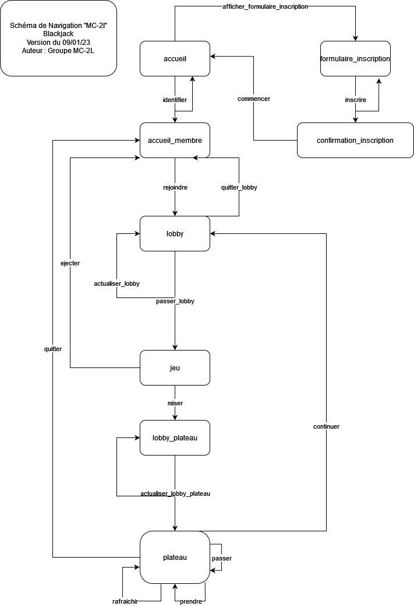

# Modèle PI



# Installation 
---

Pour l'installation, veuillez executer les commandes suivantes :

```
npm install
node ./index.js

```


# Dependencies
---

Ce projet a besoin de la version 16.5.1 de [NODE.js](https://nodejs.org/en/download/) pour fonctionner correctement. 

